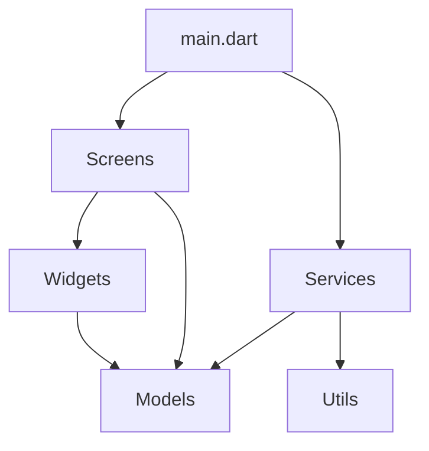

# Sistem Mimarisi ve Desenler

## Genel Mimari
UniNote, modern Flutter uygulama mimarisi prensiplerini takip eden bir yapıya sahiptir. Proje, aşağıdaki katmanlı mimariye dayanmaktadır:

```
UniNote
├── models (Veri modelleri)
├── screens (UI ekranları)
├── services (Servis katmanı)
├── utils (Yardımcı fonksiyonlar)
└── widgets (Yeniden kullanılabilir UI bileşenleri)
```

## Mimari Desenler

### 1. Katmanlı Mimari
Uygulama, sorumlulukları net bir şekilde ayıran katmanlı bir mimariye sahiptir:

- **Sunum Katmanı (Presentation Layer)**: `screens` ve `widgets` dizinlerinde bulunur. Kullanıcı arayüzü ve etkileşimlerinden sorumludur.
- **İş Mantığı Katmanı (Business Logic Layer)**: `services` dizininde bulunur. Uygulama mantığı ve veri işleme işlemlerini yönetir.
- **Veri Katmanı (Data Layer)**: `models` dizininde bulunur. Veri yapılarını ve veri erişim işlemlerini tanımlar.
- **Yardımcı Katman (Utility Layer)**: `utils` dizininde bulunur. Tarih biçimlendirme, doğrulama gibi yardımcı işlevleri içerir.

### 2. Durum Yönetimi
Uygulama, Provider paketini kullanarak durum yönetimini gerçekleştirir. Bu, uygulamanın farklı bileşenleri arasında veri paylaşımını ve UI güncellemelerini yönetmek için kullanılır.

```dart
// main.dart'tan örnek
return MultiProvider(
  // Providers burada tanımlanacak
  child: MaterialApp(
    title: 'UniNote',
    debugShowCheckedModeBanner: false,
  ),
);
```

### 3. Bağımlılık Enjeksiyonu
GetIt paketi, servis locator (hizmet bulucu) olarak kullanılarak bağımlılık enjeksiyonu sağlanır. Bu, servislerin ve diğer bileşenlerin uygulamanın farklı bölümlerinde kolayca erişilebilir olmasını sağlar.

### 4. Repository Deseni
Veri erişimi için Repository deseni kullanılması planlanmaktadır. Bu, veri kaynağı detaylarını soyutlayarak, uygulamanın geri kalanının veri kaynağından bağımsız olmasını sağlar.

### 5. Fonksiyonel Programlama
Dartz paketi kullanılarak, hata yönetimi için Either tipi ve diğer fonksiyonel programlama yapıları uygulanacaktır. Bu, hata durumlarının daha güvenli ve öngörülebilir şekilde ele alınmasını sağlar.

## Veri Modelleri
Uygulama, aşağıdaki temel veri modellerini kullanacaktır:

1. **User**: Kullanıcı bilgilerini temsil eder (kimlik, e-posta, ad, vb.)
2. **Note**: Not verilerini temsil eder (başlık, içerik, oluşturma tarihi, vb.)
3. **PDF**: PDF dosyalarını temsil eder (dosya yolu, başlık, açıklama, vb.)

Veri modelleri, JSON serileştirme için `json_annotation` ve `json_serializable` paketleri kullanılarak işaretlenecektir. Ayrıca, değer eşitliği için `equatable` paketi kullanılacaktır.

## Servisler
Uygulama, aşağıdaki temel servisleri içerecektir:

1. **AuthService**: Kimlik doğrulama işlemlerini yönetir (giriş, kayıt, çıkış, vb.)
2. **ApiService**: Backend API ile iletişimi yönetir (Dio kullanarak)
3. **StorageService**: Yerel depolama işlemlerini yönetir (flutter_secure_storage ve shared_preferences kullanarak)

## UI Bileşenleri
Uygulama, Material Design prensiplerini takip eden bir UI yapısına sahip olacaktır. Özel UI bileşenleri, `widgets` dizininde tanımlanacaktır:

1. **CustomAppBar**: Özelleştirilmiş uygulama çubuğu
2. **NoteCard**: Not kartı bileşeni
3. **LoadingIndicator**: Yükleme göstergesi

## Ekranlar
Uygulama, aşağıdaki temel ekranları içerecektir:

1. **LoginScreen**: Kullanıcı girişi ekranı
2. **HomeScreen**: Ana ekran (not listesi, kategoriler, vb.)
3. **NoteDetailScreen**: Not detay ekranı (görüntüleme, düzenleme)
4. **OtherScreens**: Diğer ekranlar (ayarlar, profil, vb.)

## Teknik Kararlar

### 1. State Management
Provider paketi, uygulamanın durum yönetimi için seçilmiştir. Bu, Flutter ekosisteminde yaygın olarak kullanılan ve anlaşılması kolay bir çözümdür.

### 2. HTTP İstemcisi
Dio paketi, HTTP istekleri için seçilmiştir. Bu, interceptor'lar, form-data desteği, request cancellation gibi gelişmiş özelliklere sahiptir.

### 3. Yerel Depolama
Hassas veriler için `flutter_secure_storage`, genel ayarlar için `shared_preferences` kullanılacaktır.

### 4. Form Yönetimi
`flutter_form_builder` paketi, form yönetimi için kullanılacaktır. Bu, form doğrulama ve yönetimi için kapsamlı bir çözüm sunar.

### 5. Uluslararasılaştırma
`intl` paketi, tarih biçimlendirme ve potansiyel olarak çoklu dil desteği için kullanılacaktır.

## Bileşen İlişkileri



Bu mimari, uygulamanın ölçeklenebilir, test edilebilir ve sürdürülebilir olmasını sağlayacak şekilde tasarlanmıştır. Proje geliştikçe, bu mimari daha da detaylandırılacak ve gerektiğinde güncellenecektir.
